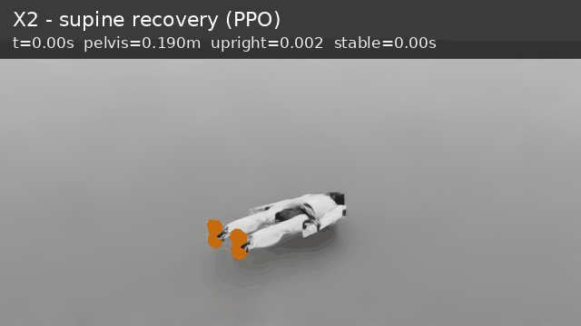
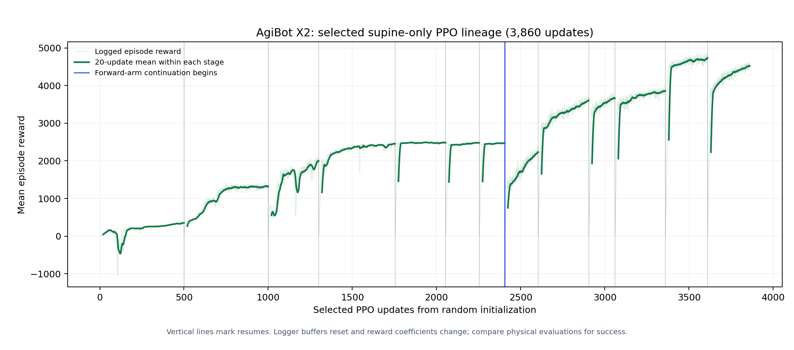

# AgiBot X2 supine recovery

This repository trains and evaluates a floating-base AgiBot X2 Ultra in Isaac Lab and connects the simulator to ROS 2 Humble. The selected result is **5/5 recoveries** in the required 10-second, supine-start episodes. Each episode ends in stable two-foot stance without support from other body parts. Five additional seeds also passed. These are nominal flat-floor simulation results.

[MP4](reports/videos/x2_recovery_supine_to_standing.mp4) · [Checkpoint](reports/checkpoints/x2_supine_single1500.pt) · [Five-episode result](reports/relaxed_v4_evaluation.json) · [Submission report](docs/submission_report.pdf)

The GIF and MP4 show **the supplied checkpoint**. The first two seconds are a frozen view of the initial supine pose; the next ten seconds are the seed-101 simulator episode. The preview does not advance the simulation clock.

## One training run, one result

The selected `model_1499.pt` came from **one uninterrupted 1,500-update PPO run**, starting with random actor/critic weights. All resets were supine, with no imitation, mixed-start pretraining, lift force, checkpoint resume, or reward change during the run. The supported forward-arm rewards were active from update 0. The reward graph and CSV below come from that same run; the video was rendered with that same final checkpoint. [Provenance and hashes](reports/configs/supine_single1500/provenance.json) make the relationship checkable.

[Reward CSV](reports/selected_supine_training_reward.csv) · [Resolved environment and PPO settings](reports/configs/supine_single1500/) · [Full evaluation rules and results](docs/validation.md)

The dark curve is a 20-update mean. Increasing reward indicates that the policy improved against the training objective; it is **not** a recovery count. The separate five-episode evaluation establishes the 5/5 result. Both feet contact the floor at the height peak in all five episodes, and strict unsupported stance lasts 8.80–9.00 seconds at episode end. Four episodes contain a brief 0.02–0.04 s upright airborne interval elsewhere; the plot and evaluation do not imply continuous foot contact at every frame.

## Setup

Tested on Ubuntu 22.04.5, RTX 5080 Laptop GPU (16 GB), Isaac Sim 6.0.1, Isaac Lab 3.0.0-beta2.patch1, RSL-RL 5.0.1 and ROS 2 Humble. Isaac runs under Python 3.12; ROS uses the system Python 3.10 in separate processes. See [ordered commands](docs/commands.md) for installation, model import, training, viewer playback, evaluation and the ROS launch.

The official AgiBot X2 Ultra v1.3.0 URDF is pinned to revision `60c5de582c523cd188f563819e62d34cfdc3d2d0`. `scripts/fetch_agibot_model.sh` retrieves it, and `scripts/import_x2_isaac.sh` converts it locally to USD. The generated USD stays outside Git. A 200 m square flat floor has collision; the robot has a floating base, 31 movable joints, imported actuator limits and self-collision. The import retains vendor meshes, inertias and joint axes. Physics runs at 200 Hz, policy control at 50 Hz. Each reset places the robot on its back at 0.190 m pelvis height, collision-clear, with neutral joints and zero velocity.

### Policy observation and action spaces

| Observation | Values |
| --- | ---: |
| Pelvis height | 1 |
| Body-frame linear and angular velocity | 6 |
| Projected gravity | 3 |
| Joint positions and velocities | 62 |
| Left/right foot contact | 2 |
| Whole-body ground-contact bits | 32 |
| Previous two eight-value actions | 16 |
| **Total policy input** | **122** |

The policy outputs eight continuous action values. Each left/right pair shares one value because the corresponding URDF joint axes have the same sign.

| Action index | Joint position targets | Joints |
| ---: | --- | ---: |
| 0 | Left/right hip pitch | 2 |
| 1 | Left/right knee | 2 |
| 2 | Left/right ankle pitch | 2 |
| 3 | Left/right shoulder pitch | 2 |
| 4 | Left/right elbow | 2 |
| 5 | Waist pitch | 1 |
| 6 | Left/right ankle roll | 2 |
| 7 | Left/right hip roll | 2 |
| **Total** | **Eight outputs vary 15 targets** | **15** |

For each controlled joint, `q_target = clamp(centre + span × tanh(action), imported 98% soft limits)`. The other 16 joints retain neutral position targets while remaining simulated and published. Actions specify position targets, not direct torques. Actor and critic are separate normalized 512/256/128 ELU MLPs; [centres and spans](docs/parameter_provenance.md#action-provenance) are listed separately.

### Reward terms in the selected run

Isaac Lab adds `weight × term value × 0.02 s` each policy step. These are reward coefficients, not neural-network weights. The table describes the **resolved 1,500-update configuration**; the exact [formulas](isaaclab_ext/x2_recovery_isaac/mdp.py) and [saved settings](reports/configs/supine_single1500/env.yaml) are available for inspection.

| Term | Weight | Purpose / active definition |
| --- | ---: | --- |
| Signed pelvis height | +40 | `clip(z/0.68) × clip((1−g_z)/2)` rewards rising in the correct orientation, not an inverted bridge. |
| Head height | +5 | Clipped exponential progress toward 1.2 m head height. |
| Upright | +5 | `exp(−g_z)`. |
| Both feet | +10 | Both feet contacting near standing height and upright orientation. |
| Other support | −1 | Count non-foot contacts near standing; early hand push-off remains allowed. |
| Balance | +20 | Low base speed near upright standing. |
| Strict stance | +20 | Instantaneous stance checks; evaluation also requires a continuous 0.5 s hold. |
| Stance proximity | +20 | Smooth approach to supported low-speed stance; training widths 0.35 tilt, 0.8 m/s linear and 2 rad/s angular speed. |
| Leg pose | +20 | Neutral hip pitch, knee and ankle pitch when raised and upright. |
| Arm pose | +40 | After supported upright stance, prefer shoulder pitch −0.22 and elbow −1.17 rad with Gaussian variance 0.5. |
| Shoulder command | +200 | In supported stance, prefer raw shoulder action near `atanh(0.14)` with variance 0.2. |
| Forward arm command | +200 | Prefer the supported forward-arm shoulder/elbow action pair with variance 2. |
| Near-stance motion | −2 | Penalize squared base linear speed plus 0.1 × squared angular speed, gated near standing. |
| Action change | −0.02 | Penalize squared successive raw-action changes. |
| Action saturation | −0.5 | Penalize commands beyond effective soft-limit ranges. |
| Joint speed | −0.0005 | Penalize squared joint velocity. |
| Torque | −1e−6 | Penalize squared joint effort. |
| Joint limit | −1 | Penalize soft-limit violation. |
| Safety termination | −10 | Penalize non-timeout safety termination. |

These terms were active from the first update. HumanUP motivates rise and contact terms; HoST motivates post-standing posture; FRASA motivates compact symmetric control. All X2 weights, gates, widths and joint targets are local choices, not values copied from those papers. [Parameter sources](docs/parameter_provenance.md) and [design evidence](docs/design_and_evidence.md) explain the distinction.

PPO uses clip 0.2, γ 0.99, GAE λ 0.95, five epochs, four minibatches, value coefficient 1, desired KL 0.01, gradient clip 1 and an adaptive learning-rate schedule.

An episode ends after 10 seconds, a non-finite state, excessive root speed or an out-of-bounds root height. Transitional ground contact does not terminate it. Recovery requires for at least 0.5 continuous seconds: pelvis height ≥0.58 m, projected-gravity XY norm ≤0.15 and Z ≤−0.98, linear/angular speed ≤0.25 m/s and 0.35 rad/s, at least 15 N on **each** foot, and less than 15 N on every other body. The five-episode evaluator observes the whole episode and requires standing at its end.

## ROS 2

`scripts/build_ros.sh` builds the Python package with colcon. The launch file starts the recovery and telemetry nodes together; an Isaac policy server runs separately and supplies real simulator state over a local Unix socket. `/x2/start_recovery` accepts a request before execution and rejects another while busy. `/x2/recovery_status` publishes `IDLE`, `RUNNING`, `SUCCEEDED` or `FAILED`; `/x2/joint_states` publishes timestamped measured joint positions while running. An unsuccessful attempt ends at a configurable timeout. [Fresh build and live checks](docs/validation.md) cover accepted and busy requests, telemetry and timeout. [Run commands](docs/commands.md) show the server, launch, watchers and service call.

The repository retains earlier experiments for audit. [Development history](docs/development_history.md) labels them separately; their plots and checkpoints are **not** the selected result. The selected training graph, video and checkpoint above all belong to the same 1,500-update run.
